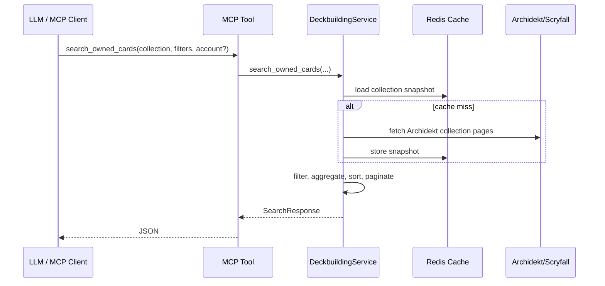

# API Reference

## ✦ API Surfaces

The server exposes three API surfaces:

- MCP tools registered by `register_mcp_tools()` in `src/archidekt_commander_mcp/app/tools.py`
- HTTP helper routes registered by `register_http_routes()` in `src/archidekt_commander_mcp/app/routes.py`
- Web UI and static icon routes registered by `register_home_and_health_routes()` in `src/archidekt_commander_mcp/app/health.py`
- MCP resources registered by `register_resources()` in `src/archidekt_commander_mcp/app/resources.py`

The MCP endpoint defaults to:

```text
/mcp
```

## ⚙ Shared Request Contracts

Collection tools require `CollectionLocator` with one of:

```json
{
  "collection": {
    "collection_id": 123456,
    "game": 1
  }
}
```

```json
{
  "collection": {
    "collection_url": "https://archidekt.com/collection/v2/123456",
    "game": 1
  }
}
```

```json
{
  "collection": {
    "username": "your_archidekt_username",
    "game": 1
  }
}
```

Authenticated tools accept optional `account` with either a token or username/email plus password:

```json
{
  "account": {
    "token": "your_archidekt_token",
    "username": "your_archidekt_username",
    "user_id": 123456
  }
}
```

```json
{
  "account": {
    "username": "your_archidekt_username",
    "password": "your_password"
  }
}
```

When MCP OAuth is active, private tools may omit `account` and use the active MCP auth session.

## 🧰 MCP Tools

| Tool | Type | Request shape | What it returns / does |
|---|---|---|---|
| `login_archidekt([account])` | Session | Optional `ArchidektAccount` | Normalized account, inferred collection locator, notes, and current personal deck list |
| `list_personal_decks([account])` | Read | Optional `ArchidektAccount` | Personal deck summaries including private/unlisted decks when authenticated |
| `search_archidekt_cards(filters)` | Read | `ArchidektCardSearchFilters` | Archidekt `card_id` values for deck and collection writes |
| `get_personal_deck_cards(deck_id, include_deleted, [account])` | Read | Deck id and optional account | Current deck cards and `deck_relation_id` values |
| `create_personal_deck(deck, [account])` | Non-destructive write | `PersonalDeckCreateInput` | Creates a personal deck and invalidates personal deck caches |
| `update_personal_deck(deck_id, deck, [account])` | Destructive write | `PersonalDeckUpdateInput` | Updates metadata such as name, description, visibility, or format |
| `delete_personal_deck(deck_id, [account])` | Destructive write | Deck id | Deletes one personal deck |
| `modify_personal_deck_cards(deck_id, cards, [account])` | Destructive write | List of `PersonalDeckCardMutation` | Adds, modifies, or removes deck cards |
| `upsert_collection_entries(entries, [account])` | Destructive write | List of `CollectionCardUpsert` | Creates or updates collection v2 rows |
| `delete_collection_entries(entries, [account])` | Destructive write | List of `CollectionCardDelete` | Deletes collection rows by `record_id` |
| `get_collection_overview(collection, [account])` | Read | `CollectionLocator` | Collection totals, owner, page count, and fetched timestamp |
| `read_collection(collection, [options], [account])` | Non-destructive write | `CollectionReadOptions` | Reads Archidekt CSV export and can write it to a local file |
| `check_collection_card_availability(collection, cards, [options], [account])` | Read | Requested cards and availability options | Free-copy calculation against collection quantity minus personal deck usage |
| `refresh_collection_cache(collection, [account])` | Non-destructive write | `CollectionLocator` | Forces snapshot refresh and returns overview |
| `search_owned_cards(collection, [filters], [account])` | Read | `CardSearchFilters` | Deterministic search against owned collection records |
| `search_unowned_cards(collection, [filters], [account])` | Read | `CardSearchFilters` | Scryfall search excluding owned cards |

## ⇄ Tool Flow



## 🌐 HTTP Routes

HTTP API routes are stateless helper surfaces for the same service methods. They accept JSON POST bodies except the Web UI, favicon/static assets, health check, and OAuth pages.

| Route | Method | Pydantic request model | Service method |
|---|---|---|---|
| `/` | GET | None | `render_home_page(runtime)` |
| `/favicon.ico` | GET | None | `ui_asset_response("favicon.ico")` |
| `/assets/{asset_name}` | GET | None | `ui_asset_response(asset_name)` |
| `/health` | GET | None | `health_payload(runtime)` |
| `/api/login` | POST | `ArchidektLoginRequest` | `login_archidekt()` |
| `/api/personal-decks` | POST | `PersonalDecksRequest` | `list_personal_decks()` |
| `/api/cards/search` | POST | `ArchidektCardSearchRequest` | `search_archidekt_cards()` |
| `/api/personal-deck-cards` | POST | `PersonalDeckCardsRequest` | `get_personal_deck_cards()` |
| `/api/personal-decks/create` | POST | `PersonalDeckCreateRequest` | `create_personal_deck()` |
| `/api/personal-decks/update` | POST | `PersonalDeckUpdateRequest` | `update_personal_deck()` |
| `/api/personal-decks/delete` | POST | `PersonalDeckDeleteRequest` | `delete_personal_deck()` |
| `/api/personal-decks/modify-cards` | POST | `PersonalDeckCardsMutationRequest` | `modify_personal_deck_cards()` |
| `/api/collection/upsert` | POST | `CollectionUpsertRequest` | `upsert_collection_entries()` |
| `/api/collection/delete` | POST | `CollectionDeleteRequest` | `delete_collection_entries()` |
| `/api/overview` | POST | `CollectionOverviewRequest` | `get_collection_overview()` |
| `/api/search-owned` | POST | `CollectionSearchRequest` | `search_owned_cards()` |
| `/api/search-unowned` | POST | `CollectionSearchRequest` | `search_unowned_cards()` |
| `/auth/archidekt-login` | GET/POST | Form/query | OAuth Archidekt login page when auth is enabled |

The Web UI is a non-technical deckbuilding page. It collects a collection locator, deck goal, commander/theme, budget, and safety preferences, then generates a prompt plus ChatGPT, Claude, and generic MCP connector steps. Browser assets are intentionally allowlisted to generated favicon/logo files.

Example HTTP owned-card search:

```bash
curl -s http://127.0.0.1:8000/api/search-owned \
  -H 'Content-Type: application/json' \
  -d '{
    "collection": {"username": "ExampleUser", "game": 1},
    "filters": {
      "type_includes": ["Instant"],
      "color_identity": ["U"],
      "color_identity_mode": "subset",
      "limit": 10,
      "page": 1
    }
  }'
```

## 🔎 Search Filters

`CardSearchFilters` supports:

- Text: `exact_name`, `name_terms_all`, `oracle_terms_all`, `oracle_terms_any`, `oracle_terms_exclude`
- Type line: `type_includes`, `type_excludes`, `subtype_includes`, `subtype_excludes`, `supertypes_includes`, `supertypes_excludes`
- Color: `colors`, `colors_mode`, `color_identity`, `color_identity_mode`
- Numeric: `cmc_min`, `cmc_max`, `mana_values`, `min_quantity`, `max_quantity`, `max_price`
- Legal/printing: `commander_legal`, `rarities`, `set_codes`, `finishes`, `include_tokens`, `unique_by`
- Sorting: `sort_by`, `sort_direction`, `limit`, `page`

Preferred `sort_by` values:

```text
name, cmc, quantity, unit_price, total_value, updated_at, added_at, edhrec_rank, rarity
```

Legacy aliases such as `price_desc`, `mana_value_desc`, and `rarity_desc` are normalized for compatibility.

## 📚 MCP Resources

| Resource URI | Purpose |
|---|---|
| `deckbuilder://collection-contract` | Collection locator and mutation identity rules |
| `deckbuilder://account-contract` | Authenticated account and OAuth-session rules |
| `deckbuilder://filter-reference` | Search filters and canonical sorting contract |
| `deckbuilder://routing-guide` | Guidance for owned/unowned search, collection-only deckbuilding, exports, and writes |

## ⚠ Error Mapping

HTTP API errors from `_handle_api_request()` are mapped as:

| Condition | Status | JSON error |
|---|---:|---|
| Invalid JSON body | `400` | `Invalid JSON body.` |
| Pydantic validation error | `422` | `Invalid payload.` |
| Archidekt/Scryfall 401 or 403 | `401` | `Archidekt authentication needs attention. Reconnect Archidekt and try again.` |
| Other upstream HTTP status error | `502` | `Remote HTTP error from Archidekt or Scryfall.` |
| RuntimeError or ValueError | `400` | The exception message |
| Unhandled exception | `500` | `Internal server error.` |
