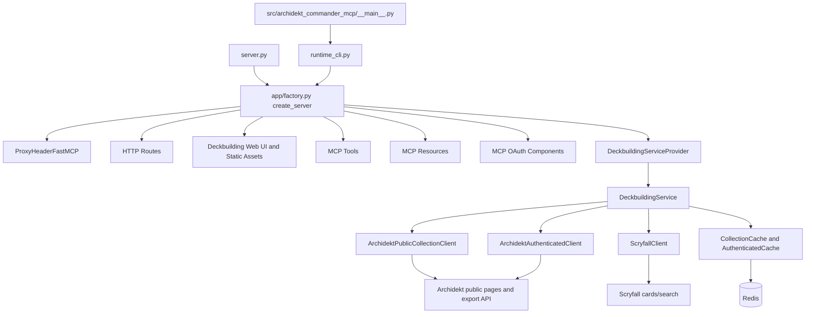
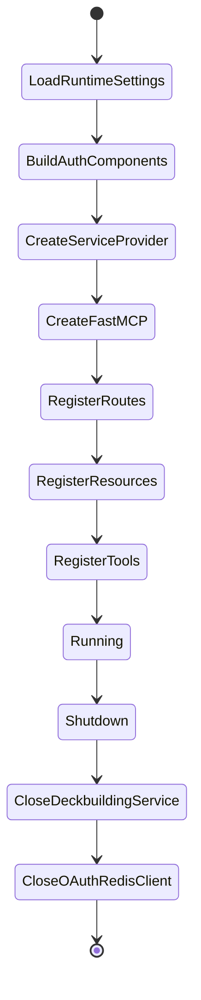
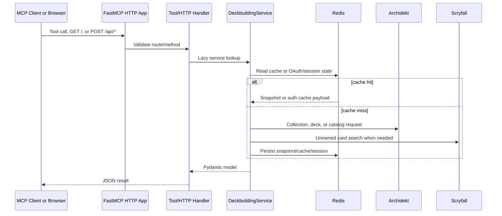

# Architecture

## ✦ Purpose And Rationale

`archidekt-mcp-server` is a stateless MCP and HTTP service for Commander deckbuilding. Its core design decision is to keep user identity and collection context out of process-global state: collection tools require a `collection` object, and private tools require either an explicit `account` payload or the current MCP OAuth session.

This keeps LLM workflows reproducible. A model can inspect the exact tool payload, know which collection or account is being used, and avoid accidentally applying a prior user's state to a new request.

## ◇ Component Overview

| Component | Responsibility | Key Files |
|---|---|---|
| Runtime settings | Loads `ARCHIDEKT_MCP_` environment variables and validates bounds | `src/archidekt_commander_mcp/config.py` |
| CLI | Builds argparse flags and starts the selected MCP transport | `src/archidekt_commander_mcp/runtime_cli.py` |
| MCP Server Assembly | Wires FastMCP, auth, routes, resources, tools, lifecycle, and proxy handling | `src/archidekt_commander_mcp/app/factory.py` |
| Web UI | Renders the non-technical deckbuilding brief builder, chatbot connection guides, generated logo, and favicon assets | `src/archidekt_commander_mcp/ui/home.py`, `src/archidekt_commander_mcp/ui/templates/home.html` |
| Service Provider | Lazily creates one `DeckbuildingService` and closes it on shutdown | `src/archidekt_commander_mcp/app/service_provider.py` |
| Deckbuilding Service | Coordinates Archidekt, Scryfall, Redis cache, OAuth identity, deck workflows, and search workflows | `src/archidekt_commander_mcp/services/deckbuilding.py` |
| Integration clients | Encapsulate remote API calls, rate limits, retries, and payload mapping | `src/archidekt_commander_mcp/integrations/` |
| Schema contracts | Pydantic inputs and outputs for MCP and HTTP surfaces | `src/archidekt_commander_mcp/schemas/` |

## ⚙ Server Assembly Lifecycle

`create_server()` in `src/archidekt_commander_mcp/app/factory.py` builds all runtime pieces. Its lifespan handler configures logging, logs startup metadata, then closes the `DeckbuildingServiceProvider` and OAuth Redis client on shutdown.

## ⇄ Request And Data Flow

HTTP routes use `_handle_api_request()` in `src/archidekt_commander_mcp/app/http_helpers.py` to parse JSON, validate Pydantic payloads, map common errors, and return JSON responses. The `/` route renders a user-facing deck request builder, while `/favicon.ico` and `/assets/{asset_name}` serve the generated Web UI icon files. MCP tools call the same service methods directly and return `model_dump(mode="json")`.

## 🔐 Authenticated Access

Authenticated Access is represented by `AuthenticatedAccount` and can come from three places:

- An `ArchidektAccount` with `token`
- An `ArchidektAccount` with `username` or `email` plus `password`
- An MCP OAuth access token stored in Redis and exposed through `account_from_auth_context()`

When `auth_enabled` is true, `build_auth_components()` requires `public_base_url` and creates `RedisArchidektOAuthProvider`. The OAuth provider stores clients, pending authorization requests, authorization codes, access tokens, refresh tokens, and session records under `ARCHIDEKT_MCP_REDIS_KEY_PREFIX`.

By default, OAuth access tokens, refresh tokens, session records, and the optional Archidekt login credential do not expire automatically. The design favors long-lived ChatGPT app sessions while making revocation and Redis protection operational responsibilities.

## 🗃 Cache Architecture

| Cache | Scope | Backend | Default TTL | Why |
|---|---|---|---|---|
| Public collection snapshot | Collection locator and game | Redis | `86400` seconds | Avoid repeated page scraping for public collection reads |
| Authenticated collection snapshot | Collection locator, game, and account identity | Redis plus memory fallback | `900` seconds | Keep private data account-scoped |
| Personal deck list | Auth token plus identity index | Redis plus memory fallback | `900` seconds | Avoid repeated deck listing during a workflow |
| Personal Deck Usage | Account identity | Redis plus memory fallback | `900` seconds | Calculate free owned copies for collection-only deckbuilding |
| Exact-name catalog lookup | Exact name, game, page, edition, token flags | Redis plus memory | `900` seconds | Batch and reuse card-id resolution |
| OAuth state | Client/session/token identifiers | Redis | Configurable; disabled by default | Persist MCP auth sessions across app restarts |

After authenticated collection writes, `mark_recent_collection_write()` stores a short marker for 120 seconds. Reads of the same self collection consume that marker and bypass cached snapshots briefly to reduce stale reads after writes.

## ✧ Domain Boundaries

`CONTEXT.md` defines the project language:

- **Authenticated Access** requires an **Archidekt Account Identity**.
- A **Collection Snapshot** belongs to one collection locator and game.
- A **Personal Deck List** produces a **Personal Deck Usage** index.
- The **Authenticated Cache** stores private collection snapshots, deck lists, and deck usage.
- **MCP Server Assembly** wires runtime settings, transports, auth, routes, resources, and tools into the running server.

The code mirrors those boundaries with `ArchidektAccountIdentity`, `CollectionCache`, `AuthenticatedCache`, `PersonalDeckWorkflow`, and `CardSearchWorkflow`.

## ▶ Operational Flow

1. Load settings from environment or CLI.
2. Create FastMCP with `streamable-http` at `/mcp` by default.
3. Register `/`, `/favicon.ico`, `/assets/{asset_name}`, `/health`, `/api/*`, OAuth routes, MCP resources, and MCP tools.
4. Lazily instantiate `DeckbuildingService` on the first tool or route call.
5. Resolve account identity only when authenticated data or writes require it.
6. Fetch or refresh collection/deck/catalog data through integration clients.
7. Store cache entries in Redis with account-aware keys.
8. Return Pydantic response models as JSON.
