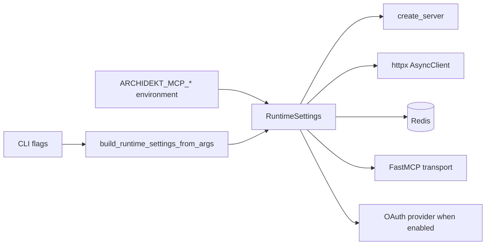

# Configuration

## ✦ Configuration Model

Runtime configuration is centralized in `RuntimeSettings` in `src/archidekt_commander_mcp/config.py`. It uses `pydantic-settings` with the environment prefix:

```text
ARCHIDEKT_MCP_
```

CLI flags in `src/archidekt_commander_mcp/runtime_cli.py` override selected settings by constructing a new `RuntimeSettings` object from parsed arguments.

## ⚙ Core Runtime Settings

| Environment variable | Default | Bounds / values | Purpose |
|---|---:|---|---|
| `ARCHIDEKT_MCP_ARCHIDEKT_BASE_URL` | `https://archidekt.com` | URL string | Base URL for Archidekt page and API requests |
| `ARCHIDEKT_MCP_SCRYFALL_BASE_URL` | `https://api.scryfall.com` | URL string | Base URL for Scryfall searches |
| `ARCHIDEKT_MCP_HOST` | `0.0.0.0` | Host string | HTTP bind host |
| `ARCHIDEKT_MCP_PORT` | `8000` | `1..65535` | HTTP bind port |
| `ARCHIDEKT_MCP_TRANSPORT` | `streamable-http` | `stdio`, `sse`, `streamable-http` | MCP transport mode |
| `ARCHIDEKT_MCP_STREAMABLE_HTTP_PATH` | `/mcp` | Path string | Streamable HTTP MCP route |
| `ARCHIDEKT_MCP_STATELESS_HTTP` | `true` | Boolean | FastMCP stateless HTTP mode |
| `ARCHIDEKT_MCP_LOG_LEVEL` | `INFO` | `DEBUG`, `INFO`, `WARNING`, `ERROR`, `CRITICAL` | Python logging level |
| `ARCHIDEKT_MCP_USER_AGENT` | `archidekt-commander-mcp/0.2 (+mailto:replace-me@example.com)` | String | User-Agent sent to Archidekt and Scryfall |

Set a real contact in `ARCHIDEKT_MCP_USER_AGENT` when exposing the server publicly.

The Python package also includes Web UI templates and generated static assets through `pyproject.toml` package data: `ui/templates/*.html` and `ui/static/*`. Those files back `/`, `/favicon.ico`, and `/assets/{asset_name}`.

## 🗃 Cache And Rate Settings

| Environment variable | Default | Bounds | Purpose |
|---|---:|---|---|
| `ARCHIDEKT_MCP_REDIS_URL` | `redis://127.0.0.1:6379/0` | Non-empty string | Redis connection URL |
| `ARCHIDEKT_MCP_REDIS_KEY_PREFIX` | `archidekt-commander` | Non-empty string | Prefix for Redis keys |
| `ARCHIDEKT_MCP_CACHE_TTL_SECONDS` | `86400` | `30..86400` | Public collection snapshot TTL |
| `ARCHIDEKT_MCP_PERSONAL_DECK_CACHE_TTL_SECONDS` | `900` | `0..3600` | Authenticated private cache TTL; `0` disables this TTL-backed cache |
| `ARCHIDEKT_MCP_ARCHIDEKT_RATE_LIMIT_MAX_REQUESTS` | `30` | `1..1000` | Max Archidekt requests per window |
| `ARCHIDEKT_MCP_ARCHIDEKT_RATE_LIMIT_WINDOW_SECONDS` | `60` | `1..3600` | Rate-limit window size |
| `ARCHIDEKT_MCP_ARCHIDEKT_RETRY_MAX_ATTEMPTS` | `3` | `1..10` | Attempts for Archidekt HTTP 429 retries |
| `ARCHIDEKT_MCP_ARCHIDEKT_RETRY_BASE_DELAY_SECONDS` | `1.0` | `0.0..60.0` | Exponential backoff base for 429 retries |
| `ARCHIDEKT_MCP_ARCHIDEKT_EXACT_NAME_CACHE_TTL_SECONDS` | `900` | `0..86400` | Exact-name Archidekt catalog lookup cache TTL |
| `ARCHIDEKT_MCP_HTTP_TIMEOUT_SECONDS` | `30.0` | `5.0..120.0` | HTTP client timeout |
| `ARCHIDEKT_MCP_MAX_SEARCH_RESULTS` | `50` | `1..100` | Server cap for collection search result limits |
| `ARCHIDEKT_MCP_SCRYFALL_MAX_PAGES` | `6` | `1..20` | Max Scryfall pages scanned for unowned search |

## 🔐 OAuth Settings

| Environment variable | Default | Bounds / values | Purpose |
|---|---:|---|---|
| `ARCHIDEKT_MCP_AUTH_ENABLED` | `false` | Boolean | Enables MCP OAuth routes and session auth |
| `ARCHIDEKT_MCP_PUBLIC_BASE_URL` | `null` | Public URL without `/mcp` | Required when auth is enabled |
| `ARCHIDEKT_MCP_AUTH_CODE_TTL_SECONDS` | `600` | `60..3600` | Pending request and authorization code TTL |
| `ARCHIDEKT_MCP_AUTH_ACCESS_TOKEN_TTL_SECONDS` | `null` | `300..2592000`, or disabled | OAuth access token TTL; disabled means no automatic expiration |
| `ARCHIDEKT_MCP_AUTH_REFRESH_TOKEN_TTL_SECONDS` | `null` | `3600..31536000`, or disabled | OAuth refresh token TTL; disabled means no automatic expiration |
| `ARCHIDEKT_MCP_AUTH_PERSIST_LOGIN_CREDENTIALS` | `true` | Boolean | Stores Archidekt login credential for silent token renewal |

For optional TTL variables, `0`, `none`, `null`, `never`, `infinite`, `infinity`, `disabled`, and `off` normalize to no automatic expiration.

## ⇄ Configuration Flow



## ▶ CLI Flags

`build_arg_parser()` exposes these flags:

```text
--transport
--host
--port
--log-level
--cache-ttl-seconds
--personal-deck-cache-ttl-seconds
--redis-url
--redis-key-prefix
--http-timeout-seconds
--max-search-results
--scryfall-max-pages
--user-agent
--streamable-http-path
--forwarded-allow-ips
```

Example:

```bash
python -m archidekt_commander_mcp.server \
  --transport streamable-http \
  --host 127.0.0.1 \
  --port 8000 \
  --redis-url redis://127.0.0.1:6379/0 \
  --user-agent "archidekt-mcp-server/0.3 (+mailto:you@example.com)"
```

## ⛨ Proxy Header Trust

`ARCHIDEKT_MCP_FORWARDED_ALLOW_IPS` defaults to `127.0.0.1`. It is passed to Uvicorn's `ProxyHeadersMiddleware` and the project's `RealIPHeaderMiddleware`.

Use a specific proxy IP or CIDR when deployed behind a reverse proxy:

```bash
export ARCHIDEKT_MCP_FORWARDED_ALLOW_IPS=10.0.0.0/8
```

The bundled `compose.yml` sets `ARCHIDEKT_MCP_FORWARDED_ALLOW_IPS: "*"` for convenience. That is only appropriate when all direct traffic reaches the app through trusted infrastructure.
