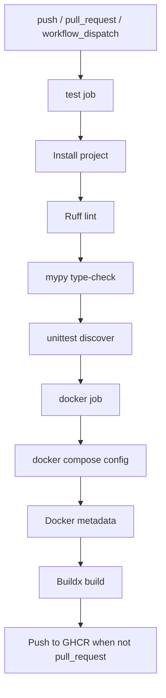

# Deployment

## ✦ Deployment Model

The production path is a Python application container plus Redis. The server process is stateless with respect to user workflows, while Redis stores collection snapshots, authenticated private cache entries, exact-name lookup cache entries, and optional MCP OAuth state.

## 🐳 Docker Image

`Dockerfile` and `Containerfile` are equivalent and use:

- Base image: `python:3.13-slim`
- Workdir: `/app`
- Runtime user: `appuser`
- Exposed port: `8000`
- Health check: `GET http://127.0.0.1:8000/health`
- Command: `python -m archidekt_commander_mcp.server`

Build:

```bash
docker build -t archidekt-mcp-server:latest .
```

Run a container only after providing Redis:

```bash
docker run --rm -p 8000:8000 \
  -e ARCHIDEKT_MCP_REDIS_URL=redis://host.docker.internal:6379/0 \
  -e ARCHIDEKT_MCP_USER_AGENT="archidekt-mcp-server/0.3 (+mailto:you@example.com)" \
  archidekt-mcp-server:latest
```

## ◇ Compose Stack

`compose.yml` defines:

| Service | Image/build | Purpose |
|---|---|---|
| `redis` | `redis:7.4-alpine` | Persistent cache and OAuth/session store |
| `app` | Built from `Dockerfile` | MCP server, deckbuilding Web UI, HTTP API, favicon/logo assets |

Start:

```bash
docker compose up --build -d
```

Stop:

```bash
docker compose down
```

The Redis service uses append-only persistence on the `redis-data` named volume:

```yaml
command: ["redis-server", "--appendonly", "yes", "--appendfsync", "everysec", "--save", "60", "1000", "--dir", "/data"]
```

This matters because OAuth session records and optional Archidekt login-renewal credentials can persist across app restarts.

## ⇄ Deployment Flow

```mermaid
flowchart TD
    Source[Repository] --> Build[Docker build]
    Build --> Image[archidekt-mcp-server:latest]
    Image --> App[app service]
    Redis[redis service + redis-data volume] --> App
    App --> Health[/health]
    App --> WebUI[/]
    App --> MCP[/mcp]
    ReverseProxy[Optional reverse proxy] --> App
```

## 🚢 Podman

Build:

```bash
podman build -f Containerfile -t archidekt-mcp-server:latest .
```

Run the compose stack with Podman Compose:

```bash
podman compose up --build -d
```

## ⚙ Reverse Proxy Notes

When deployed behind a reverse proxy:

1. Set `ARCHIDEKT_MCP_PUBLIC_BASE_URL` to the public base URL if OAuth is enabled.
2. Keep the MCP endpoint at `ARCHIDEKT_MCP_STREAMABLE_HTTP_PATH`, default `/mcp`.
3. Configure the proxy to pass `X-Forwarded-For` or `X-Real-IP`.
4. Set `ARCHIDEKT_MCP_FORWARDED_ALLOW_IPS` to the trusted proxy IP or CIDR.

Avoid `ARCHIDEKT_MCP_FORWARDED_ALLOW_IPS=*` on an exposed app unless every direct connection is forced through trusted proxy infrastructure.

## 🔐 OAuth Deployment Checklist

For ChatGPT, Claude, or another remote MCP client:

```bash
export ARCHIDEKT_MCP_AUTH_ENABLED=true
export ARCHIDEKT_MCP_PUBLIC_BASE_URL=https://your-public-domain
export ARCHIDEKT_MCP_REDIS_URL=redis://redis:6379/0
```

Operational requirements:

- Redis must be private.
- Redis persistence should be enabled if sessions must survive restarts.
- Use HTTPS at the public base URL.
- Preserve the `/mcp` path unless the client configuration is updated.
- Disconnect/revoke the app to remove active OAuth sessions.

The Web UI warns when it is opened from `localhost` or `127.0.0.1`, because cloud chatbots need a public HTTPS URL for the same server before the connector can reach `/mcp`.

## 🧪 CI/CD

`.github/workflows/docker.yml` runs on:

- Pushes to `main`
- Pull requests targeting `main`
- Manual dispatch

Pipeline:



Published image:

```text
ghcr.io/dnviti/archidekt-mcp-server:latest
```

## ✔ Production Smoke Checks

Check health:

```bash
curl -fsS http://127.0.0.1:8000/health
```

Check routes in a running app by opening:

```text
http://127.0.0.1:8000/
http://127.0.0.1:8000/deckbuilder
http://127.0.0.1:8000/connect
http://127.0.0.1:8000/functions
http://127.0.0.1:8000/account
http://127.0.0.1:8000/host
http://127.0.0.1:8000/favicon.ico
http://127.0.0.1:8000/mcp
```

Validate Compose before deploying:

```bash
docker compose config
```
