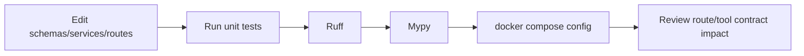

# Development

## ✦ Development Principles

The codebase favors explicit contracts over implicit behavior:

- Pydantic schemas define public inputs and outputs.
- `SERVER_INSTRUCTIONS` documents model-facing behavior.
- Tests freeze route inventory, tool roster, CLI flags, sorting aliases, auth behavior, cache invalidation, and mutation semantics.
- `CONTEXT.md` defines domain language so code and docs use the same terms.

## ▶ Local Workflow

Install in editable mode:

```bash
python -m venv .venv
source .venv/bin/activate
python -m pip install --upgrade pip
python -m pip install -e .
```

Run the server:

```bash
export ARCHIDEKT_MCP_REDIS_URL=redis://127.0.0.1:6379/0
python -m archidekt_commander_mcp.server --host 127.0.0.1 --port 8000
```

Run checks:

```bash
python -m ruff check src/archidekt_commander_mcp
python -m mypy src/archidekt_commander_mcp
python -m unittest discover -s tests -v
```

## 🧪 Test Layout

| File | Coverage area |
|---|---|
| `tests/test_server.py` | Route inventory, Web UI rendering, favicon/static assets, OAuth routes, health, proxy headers, API error mapping, CLI flags, runtime env, tool roster, annotations, auth/session/cache/mutation behavior |
| `tests/test_filters.py` | Color normalization, Scryfall query building, filter matching, sorting aliases, result ordering |
| `tests/support.py` | Fake Redis, fake Archidekt/Scryfall clients, token-scoped helpers, TTL helpers |

The tests rely heavily on fakes instead of live Archidekt or Scryfall calls. That keeps the development loop deterministic and avoids network-dependent failures.

## ⇄ Change Workflow



When changing public behavior, update the matching layer:

- New MCP tool: update `app/tools.py`, `server_contracts.py`, tests in `tests/test_server.py`, and API docs.
- New HTTP route: update `app/routes.py` or `app/health.py`, request/static asset handling, route inventory test, and API docs.
- New filter: update `schemas/search.py`, `filtering.py`, Scryfall mapping if needed, tests, and `deckbuilder://filter-reference`.
- New runtime setting: update `config.py`, `runtime_cli.py` if CLI-exposed, README, Compose/Docker if deployment needs it, and configuration docs.

## ⚙ Type And Lint Configuration

`pyproject.toml` configures:

```toml
[tool.ruff]
target-version = "py311"
src = ["src"]

[tool.ruff.lint]
select = ["E4", "E7", "E9", "F"]

[tool.mypy]
python_version = "3.12"
check_untyped_defs = true
warn_return_any = true
warn_unused_ignores = true
no_implicit_optional = true
```

The package includes `src/archidekt_commander_mcp/ui/templates/*.html` and `src/archidekt_commander_mcp/ui/static/*` as package data. Keep favicon/logo assets in the static allowlist served by `ui_asset_response()`.

## 🌿 Branch Context

The current project configuration reports:

| Branch role | Branch |
|---|---|
| Current | `main` |
| Development | `main` |
| Staging | `staging` |
| Production | `main` |
| Release branch | `main` |

The configured repository URL is:

```text
https://github.com/dnviti/archidekt-mcp-server
```

## ✧ Domain Language

Use these terms from `CONTEXT.md` in code, tests, and docs:

- **Authenticated Access**
- **Archidekt Account Identity**
- **Collection Snapshot**
- **Personal Deck List**
- **Personal Deck Usage**
- **Authenticated Cache**
- **MCP Server Assembly**

Avoid ambiguous alternatives such as "private mode", "claimed user", "inventory dump", or generic "cache" when a more precise term applies.

## ✔ Pre-PR Checklist

Before opening a PR or merging:

```bash
python -m ruff check src/archidekt_commander_mcp
python -m mypy src/archidekt_commander_mcp
python -m unittest discover -s tests -v
docker compose config
```

Review whether generated docs need updating:

```bash
DM check-staleness
```
