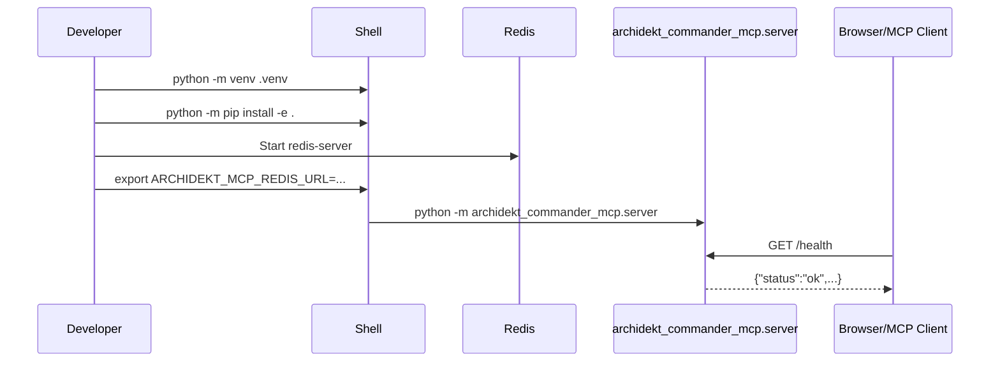

# Getting Started

## ✦ Prerequisites

Install:

- Python `>=3.11`
- Redis reachable by URL, default `redis://127.0.0.1:6379/0`
- Docker or Podman when using container workflows

The Python package name is `archidekt-commander-mcp`. The console script is:

```bash
archidekt-commander-mcp
```

The module entry point is:

```bash
python -m archidekt_commander_mcp.server
```

## ▶ Local Installation

From the repository root:

```bash
python -m venv .venv
source .venv/bin/activate
python -m pip install --upgrade pip
python -m pip install -e .
```

On Windows PowerShell, use:

```powershell
python -m venv .venv
.venv\Scripts\activate
python -m pip install --upgrade pip
python -m pip install -e .
```

## ⚙ First Run

Start Redis first. Then set the minimum useful runtime variables:

```bash
export ARCHIDEKT_MCP_HOST=127.0.0.1
export ARCHIDEKT_MCP_PORT=8000
export ARCHIDEKT_MCP_REDIS_URL=redis://127.0.0.1:6379/0
export ARCHIDEKT_MCP_CACHE_TTL_SECONDS=86400
export ARCHIDEKT_MCP_PERSONAL_DECK_CACHE_TTL_SECONDS=900
export ARCHIDEKT_MCP_ARCHIDEKT_RATE_LIMIT_MAX_REQUESTS=30
export ARCHIDEKT_MCP_ARCHIDEKT_RATE_LIMIT_WINDOW_SECONDS=60
export ARCHIDEKT_MCP_ARCHIDEKT_RETRY_MAX_ATTEMPTS=3
export ARCHIDEKT_MCP_ARCHIDEKT_RETRY_BASE_DELAY_SECONDS=1.0
export ARCHIDEKT_MCP_ARCHIDEKT_EXACT_NAME_CACHE_TTL_SECONDS=900
export ARCHIDEKT_MCP_USER_AGENT="archidekt-mcp-server/0.3 (+mailto:you@example.com)"
python -m archidekt_commander_mcp.server
```

Open:

- Web UI: `http://127.0.0.1:8000/`
- Health check: `http://127.0.0.1:8000/health`
- MCP endpoint: `http://127.0.0.1:8000/mcp`

The Web UI is meant for deckbuilders first and server operators second. It exposes:

- `/deckbuilder` for collection-aware deck requests
- `/connect` for ChatGPT, Claude, and other connector setup
- `/functions` for a readable feature catalog
- `/account` for Archidekt OAuth sign-in and private deck helpers
- `/host` for health and hosting information

The theme toggle persists light/dark mode in browser storage.

## ⇄ Startup Sequence



## 🐳 Compose Run

The repository includes `compose.yml` with two services:

- `redis`, using `redis:7.4-alpine` with append-only persistence
- `app`, built from `Dockerfile` and published on host port `8000`

Start:

```bash
docker compose up --build -d
```

Stop:

```bash
docker compose down
```

With the stack running:

- Web UI: `http://127.0.0.1:8000/`
- MCP endpoint: `http://127.0.0.1:8000/mcp`

## 🔐 Optional MCP OAuth

Enable OAuth when remote MCP clients, such as ChatGPT or Claude, should attach an Archidekt identity to the MCP session:

```bash
export ARCHIDEKT_MCP_AUTH_ENABLED=true
export ARCHIDEKT_MCP_PUBLIC_BASE_URL=https://your-public-domain
```

`ARCHIDEKT_MCP_PUBLIC_BASE_URL` must be the public base URL without `/mcp`. When enabled, clients use:

- `/.well-known/oauth-authorization-server`
- `/authorize`
- `/token`
- `/register`
- `/revoke`
- `/auth/archidekt-login`
- `/mcp`

Cloud chatbots need a public HTTPS URL for the same server. A local `127.0.0.1` or `localhost` Web UI is useful for local testing but cannot be reached by ChatGPT or Claude cloud connectors.

## ✔ Smoke Checks

Run the health check:

```bash
curl http://127.0.0.1:8000/health
```

Expected fields include:

- `status: "ok"`
- `service: "archidekt-commander-mcp"`
- `transport: "streamable-http"`
- `cache_backend: "redis"`
- `mcp_path: "/mcp"`

Run the local quality gates:

```bash
python -m ruff check src/archidekt_commander_mcp
python -m mypy src/archidekt_commander_mcp
python -m unittest discover -s tests -v
```

## ✧ First MCP Client Configuration

Example Codex MCP configuration:

```toml
[mcp_servers.archidekt-commander]
url = "http://127.0.0.1:8000/mcp"
tool_timeout_sec = 60
```

Because the server is stateless, every collection-related tool call must include `collection`.
