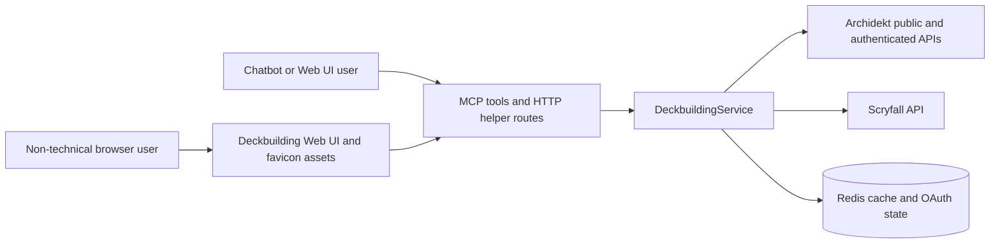

# archidekt-mcp-server

Stateless MCP server for Commander deckbuilding against Archidekt collections, personal decks, and Scryfall. It is built for chatbot-driven workflows where every collection request carries an explicit locator, the Web UI prepares a non-technical deckbuilding brief, and authenticated access can come from either an `account` payload or an MCP OAuth session.

## ✦ Documentation Map

| Section | File | Purpose |
|---|---|---|
| Architecture | [architecture.md](architecture.md) | Runtime assembly, service boundaries, data flow, and design rationale |
| Getting Started | [getting-started.md](getting-started.md) | Prerequisites, local setup, first run, and smoke checks |
| Configuration | [configuration.md](configuration.md) | Runtime settings, environment variables, CLI flags, and OAuth settings |
| API Reference | [api-reference.md](api-reference.md) | MCP tools, HTTP routes, resources, and request contracts |
| Deployment | [deployment.md](deployment.md) | Docker, Compose, Podman, CI/CD, GHCR publishing, and proxy notes |
| Development | [development.md](development.md) | Local workflows, tests, linting, typing, and branch context |
| Troubleshooting | [troubleshooting.md](troubleshooting.md) | Common errors, diagnostics, cache behavior, and auth recovery |
| LLM Context | [llm-context.md](llm-context.md) | Consolidated machine-readable context for agents and bots |

## ⚙ Technology Stack

| Layer | Technology | Where |
|---|---|---|
| Language | Python 3.11+ package, Docker runtime on Python 3.13 | `pyproject.toml`, `Dockerfile` |
| MCP server | `mcp[cli]`, FastMCP, streamable HTTP by default | `src/archidekt_commander_mcp/app/factory.py` |
| HTTP app | Starlette custom routes exposed through FastMCP | `src/archidekt_commander_mcp/app/routes.py` |
| Runtime server | Uvicorn through FastMCP `server.run()` | `src/archidekt_commander_mcp/runtime_cli.py` |
| Validation | Pydantic v2 and pydantic-settings | `src/archidekt_commander_mcp/schemas/`, `config.py` |
| External HTTP | `httpx.AsyncClient` | `src/archidekt_commander_mcp/services/deckbuilding.py` |
| Cache/session store | Redis async client | `integrations/collection_cache.py`, `auth/provider.py` |
| Quality gates | Ruff, mypy, unittest | `pyproject.toml`, `.github/workflows/docker.yml` |

## ▶ Quick Start

Install locally:

```bash
python -m venv .venv
source .venv/bin/activate
python -m pip install --upgrade pip
python -m pip install -e .
```

Start Redis, then run the server:

```bash
export ARCHIDEKT_MCP_HOST=127.0.0.1
export ARCHIDEKT_MCP_PORT=8000
export ARCHIDEKT_MCP_REDIS_URL=redis://127.0.0.1:6379/0
python -m archidekt_commander_mcp.server
```

Open:

- Web UI: `http://127.0.0.1:8000/`
- Health check: `http://127.0.0.1:8000/health`
- MCP endpoint: `http://127.0.0.1:8000/mcp`

The Web UI is a deckbuilding handoff page for non-technical users. It collects a collection locator, deck goal, commander/theme, budget, and safety preferences, then generates a prompt to paste into ChatGPT, Claude, or another MCP-capable chatbot.

## ◇ Why This Project Exists

The server gives an LLM a deterministic tool layer for Commander deckbuilding. It avoids hidden server-side user state, normalizes Archidekt and Scryfall data into Pydantic models, and makes authenticated deck and collection writes explicit enough for clients to reason about safety before mutating a user account.

## ✧ Runtime Shape



## ◈ Website Icon Assets

Generated favicon assets are available in `docs/assets/`:

- `favicon.ico`
- `favicon-16.png`
- `favicon-32.png`
- `favicon-192.png`
- `favicon-512.png`
- `logo-generated.png`

The packaged Web UI also serves matching assets at `/favicon.ico` and `/assets/{asset_name}` so browsers can use the generated logo as the site icon.

## ✔ Verification Commands

Use these project-native commands after changing behavior:

```bash
python -m ruff check src/archidekt_commander_mcp
python -m mypy src/archidekt_commander_mcp
python -m unittest discover -s tests -v
docker compose config
```
