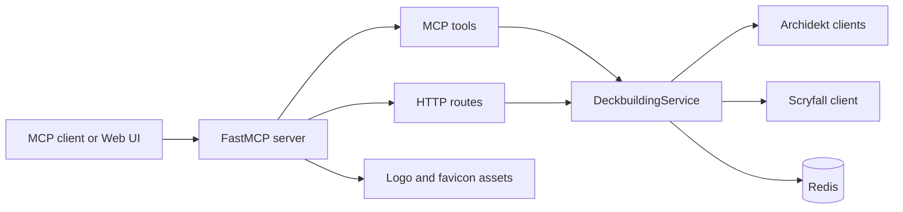

# LLM Context

## ✦ Metadata

| Field | Value |
|---|---|
| Project | `archidekt-mcp-server` |
| Package | `archidekt-commander-mcp` |
| Primary module | `archidekt_commander_mcp.server` |
| Console script | `archidekt-commander-mcp` |
| Default transport | `streamable-http` |
| Default MCP path | `/mcp` |
| Default HTTP port | `8000` |
| Cache backend | Redis |
| Main external APIs | Archidekt, Scryfall |

## ◇ Project Summary

This is a stateless MCP server for deckbuilding against Archidekt collections, personal decks, and Scryfall. It exposes MCP tools, HTTP helper routes, an English Web UI for non-technical deckbuilders, generated favicon/logo assets, and optional MCP OAuth for remote clients.

The server never assumes a remembered collection. Every collection-related call requires a `collection` object. Authenticated private reads and writes require either an `account` object or an MCP OAuth session.

## ✧ Domain Terms

- **Authenticated Access**: request path that can use a verified Archidekt token.
- **Archidekt Account Identity**: verified Archidekt user identity attached to a token.
- **Collection Snapshot**: point-in-time view of a collection locator and game.
- **Personal Deck List**: current decks visible to an authenticated account.
- **Personal Deck Usage**: index of which personal decks already contain a card and quantity.
- **Authenticated Cache**: private cache state derived from authenticated Archidekt data.
- **MCP Server Assembly**: runtime wiring of settings, transports, auth, routes, resources, and tools.

## ⚙ Architecture Summary



Important files:

- `src/archidekt_commander_mcp/app/factory.py`: `create_server()` assembly
- `src/archidekt_commander_mcp/config.py`: `RuntimeSettings`
- `src/archidekt_commander_mcp/runtime_cli.py`: CLI and startup
- `src/archidekt_commander_mcp/app/tools.py`: MCP tools
- `src/archidekt_commander_mcp/app/health.py`: homepage, health, favicon, and static Web UI asset routes
- `src/archidekt_commander_mcp/app/routes.py`: HTTP routes
- `src/archidekt_commander_mcp/ui/home.py`: Web UI renderer and allowlisted asset response helper
- `src/archidekt_commander_mcp/ui/templates/home.html`: deckbuilding request builder and chatbot connector guide
- `src/archidekt_commander_mcp/services/deckbuilding.py`: orchestration service
- `src/archidekt_commander_mcp/services/card_search.py`: owned/unowned/catalog search workflows
- `src/archidekt_commander_mcp/services/personal_decks.py`: authenticated deck workflows
- `src/archidekt_commander_mcp/auth/provider.py`: Redis OAuth provider
- `src/archidekt_commander_mcp/server_contracts.py`: model-facing instructions and tool annotations

## 🧰 Key MCP Tools

Use these exact tool names:

```text
login_archidekt
list_personal_decks
search_archidekt_cards
get_personal_deck_cards
create_personal_deck
update_personal_deck
delete_personal_deck
modify_personal_deck_cards
upsert_collection_entries
delete_collection_entries
get_collection_overview
read_collection
check_collection_card_availability
refresh_collection_cache
search_owned_cards
search_unowned_cards
```

Routing guidance:

- Owned card questions: `search_owned_cards`
- Missing card or upgrade questions: `search_unowned_cards`
- Collection totals: `get_collection_overview`
- Full CSV export: `read_collection`
- Archidekt card ids for writes: `search_archidekt_cards`
- Current personal decks: `login_archidekt` or `list_personal_decks`
- Editing an existing deck: `get_personal_deck_cards` first to get `deck_relation_id`
- Collection-only deckbuilding: `check_collection_card_availability` before deck writes

## ⚙ Request Contract Summary

Collection locator:

```json
{
  "collection": {
    "collection_id": 123456,
    "game": 1
  }
}
```

or:

```json
{
  "collection": {
    "username": "archidekt_username",
    "game": 1
  }
}
```

Authenticated account:

```json
{
  "account": {
    "token": "archidekt_token",
    "username": "archidekt_username",
    "user_id": 123456
  }
}
```

Search filters commonly used by LLMs:

```json
{
  "filters": {
    "type_includes": ["Instant"],
    "oracle_terms_any": ["draw a card", "counter target spell"],
    "color_identity": ["U"],
    "color_identity_mode": "subset",
    "commander_legal": true,
    "sort_by": "edhrec_rank",
    "sort_direction": "asc",
    "limit": 25,
    "page": 1
  }
}
```

## 🔐 Auth Summary

Private access can use:

1. `account.token`
2. `account.username` or `account.email` plus `account.password`
3. MCP OAuth session when `ARCHIDEKT_MCP_AUTH_ENABLED=true`

Default OAuth behavior stores access tokens, refresh tokens, session records, and login-renewal credentials in Redis without automatic expiration. Set `ARCHIDEKT_MCP_AUTH_PERSIST_LOGIN_CREDENTIALS=false` to disable login credential persistence.

## 🌐 Web UI Summary

- `/`, `/deckbuilder`, `/connect`, `/functions`, `/account`, and `/host` render a routed website for users who want to create or improve decks from Archidekt collections.
- The page collects collection locator, deck goal, format/theme, budget, existing deck URL, owned-card preference, and write-confirmation preference.
- It generates a deckbuilding prompt and shows ChatGPT, Claude, and generic connector steps for the server's `/mcp` URL.
- `/functions` lists the major MCP tools and HTTP helpers in user-facing language.
- `/account` restores browser Archidekt OAuth sign-in and can load authenticated account or personal deck JSON through the HTTP helper routes.
- The theme toggle persists light/dark mode in browser local storage.
- `/favicon.ico` and `/assets/{asset_name}` serve allowlisted generated logo/favicon assets included as package data.
- ChatGPT and Claude cloud connectors need a public HTTPS server URL; localhost URLs are only useful for local browser testing.

## 🗃 Cache Summary

- Public collection snapshots: Redis, `ARCHIDEKT_MCP_CACHE_TTL_SECONDS`, default `86400`.
- Authenticated collection snapshots, personal deck lists, and Personal Deck Usage: Redis plus memory fallback, `ARCHIDEKT_MCP_PERSONAL_DECK_CACHE_TTL_SECONDS`, default `900`.
- Archidekt exact-name catalog lookup: Redis plus memory, `ARCHIDEKT_MCP_ARCHIDEKT_EXACT_NAME_CACHE_TTL_SECONDS`, default `900`.
- Recent collection writes set 120-second markers to bypass stale self-collection snapshots.

## ▶ Quick Commands

Install:

```bash
python -m venv .venv
source .venv/bin/activate
python -m pip install --upgrade pip
python -m pip install -e .
```

Run:

```bash
export ARCHIDEKT_MCP_REDIS_URL=redis://127.0.0.1:6379/0
python -m archidekt_commander_mcp.server --host 127.0.0.1 --port 8000
```

Test:

```bash
python -m ruff check src/archidekt_commander_mcp
python -m mypy src/archidekt_commander_mcp
python -m unittest discover -s tests -v
```

Compose:

```bash
docker compose up --build -d
docker compose down
```

## ⚠ Safety Rules For Agents

- Do not assume the server remembers a previous collection.
- Pass `collection` on every collection-related tool call.
- Reuse `account` returned by `login_archidekt` when not using MCP OAuth.
- Use `archidekt_card_ids` and `archidekt_record_ids` returned by tools instead of guessing ids.
- For singleton formats, only basic lands should normally exceed one copy.
- Before collection-only deck writes, call `check_collection_card_availability` and avoid cards with `must_not_use=true` or `enough_copies=false`.
- Prefer canonical sorting: `sort_by` plus `sort_direction`.
