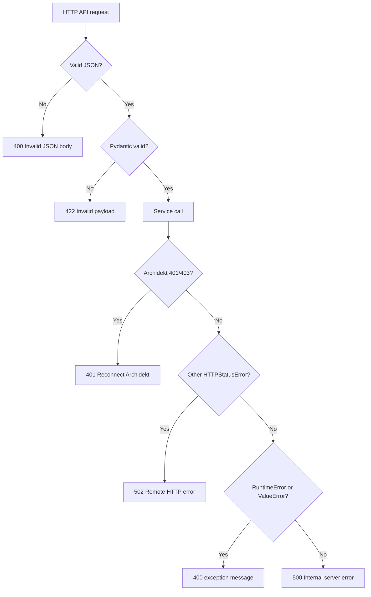

# Troubleshooting

## ✦ Diagnostic Entry Points

Start with:

```bash
curl -s http://127.0.0.1:8000/health
```

For Web UI issues, also check:

```bash
curl -I http://127.0.0.1:8000/
curl -I http://127.0.0.1:8000/favicon.ico
```

Useful health fields:

- `status`
- `transport`
- `mcp_path`
- `cache_backend`
- `private_cache_backend`
- `mcp_auth_enabled`
- `oauth_session_backend`
- `oauth_access_token_persistent`
- `oauth_refresh_token_persistent`
- `oauth_archidekt_login_renewal_enabled`

Increase logs:

```bash
export ARCHIDEKT_MCP_LOG_LEVEL=DEBUG
python -m archidekt_commander_mcp.server
```

## ⚠ HTTP Error Reference



| Symptom | Likely cause | Fix |
|---|---|---|
| `400 Invalid JSON body.` | Request body is not valid JSON | Send `Content-Type: application/json` and valid JSON |
| `422 Invalid payload.` | Pydantic schema rejected the payload | Check required fields such as `collection`, `filters`, `deck_id`, or mutation ids |
| `401 Archidekt authentication needs attention.` | Token expired, missing private access, or OAuth session needs renewal | Reconnect OAuth or call `login_archidekt(account)` again |
| `502 Remote HTTP error from Archidekt or Scryfall.` | Upstream service returned a non-auth HTTP failure | Retry later, inspect logs, confirm public URLs and rate limits |
| `500 Internal server error.` | Unhandled bug path | Reproduce with `ARCHIDEKT_MCP_LOG_LEVEL=DEBUG` and run tests |

## 🔐 OAuth Problems

| Symptom | Cause | Fix |
|---|---|---|
| Server fails at startup with auth enabled | `ARCHIDEKT_MCP_PUBLIC_BASE_URL` is missing | Set `ARCHIDEKT_MCP_PUBLIC_BASE_URL=https://your-public-domain` |
| `/auth/archidekt-login` says request id is missing | The OAuth authorize redirect was not used | Restart client app connection from the MCP client |
| `/auth/archidekt-login` says request expired | Pending authorization request exceeded `AUTH_CODE_TTL_SECONDS` | Restart connection and complete login within the TTL |
| Private tools say account is required | No explicit `account` and no MCP OAuth access token in context | Connect through OAuth or pass `account` |
| Token renewal does not happen | `AUTH_PERSIST_LOGIN_CREDENTIALS=false` or session lacks stored credential | Reconnect Archidekt or enable credential persistence if acceptable |

Redis keys for OAuth are namespaced like:

```text
<redis_key_prefix>:oauth:client:<client_id>
<redis_key_prefix>:oauth:pending:<request_id>
<redis_key_prefix>:oauth:auth-code:<code>
<redis_key_prefix>:oauth:access-token:<token>
<redis_key_prefix>:oauth:refresh-token:<token>
<redis_key_prefix>:oauth:session:<session_id>
```

Protect Redis because it can contain Archidekt tokens and, by default, login-renewal credentials.

## 🌐 Chatbot Connector Problems

| Symptom | Cause | Fix |
|---|---|---|
| ChatGPT or Claude cannot connect to the URL copied from the Web UI | The page was opened on `localhost` or `127.0.0.1` | Deploy the same server behind public HTTPS and copy that URL instead |
| Browser favicon is missing | Static package data or asset route is missing | Confirm `src/archidekt_commander_mcp/ui/static/favicon.ico` exists and `GET /favicon.ico` returns `200` |
| Chatbot can browse public collections but cannot read private decks or write changes | OAuth is disabled or the chatbot has not connected through OAuth | Enable `ARCHIDEKT_MCP_AUTH_ENABLED=true`, set `ARCHIDEKT_MCP_PUBLIC_BASE_URL`, and reconnect the chatbot |

## 🗃 Cache Issues

| Symptom | Cause | Fix |
|---|---|---|
| Collection appears stale after a write | Normal cache TTL or delayed Archidekt consistency | Use `refresh_collection_cache`; authenticated self reads also bypass cache briefly after writes |
| Private deck usage appears stale | Personal deck cache TTL or old usage snapshot | Use `check_collection_card_availability(..., options={"force_refresh": true})` |
| Redis outage causes repeated remote calls | Public cache cannot load/store | Restore Redis and inspect logs for Redis warnings |
| Exact-name card search repeats too often | `ARCHIDEKT_MCP_ARCHIDEKT_EXACT_NAME_CACHE_TTL_SECONDS=0` or cache miss | Restore positive TTL or verify Redis connectivity |

## ⏱ Rate Limit And Retry Behavior

Archidekt requests pass through `ArchidektRequestGate`, configured by:

```text
ARCHIDEKT_MCP_ARCHIDEKT_RATE_LIMIT_MAX_REQUESTS
ARCHIDEKT_MCP_ARCHIDEKT_RATE_LIMIT_WINDOW_SECONDS
ARCHIDEKT_MCP_ARCHIDEKT_RETRY_MAX_ATTEMPTS
ARCHIDEKT_MCP_ARCHIDEKT_RETRY_BASE_DELAY_SECONDS
```

If Archidekt returns HTTP 429, `_request_archidekt()` honors `Retry-After` when present. Otherwise it uses exponential backoff capped at 8 seconds.

## 🧭 Collection Locator Problems

`CollectionLocator` requires at least one of:

- `collection_id`
- `collection_url`
- `username`

If `collection_url` is used, it must contain an Archidekt collection id in a path like:

```text
/collection/123456
/collection/v2/123456
```

When only `username` is provided, `ArchidektPublicCollectionClient.resolve_collection_id()` fetches `https://archidekt.com/u/<username>` and searches for `/collection/v2/<id>` in the profile page.

## ⛨ Proxy And Client IP Problems

If logs show the Docker bridge gateway instead of the real external client IP:

1. Put the app behind a reverse proxy that sets `X-Forwarded-For` or `X-Real-IP`.
2. Set `ARCHIDEKT_MCP_FORWARDED_ALLOW_IPS` to the trusted proxy IP/CIDR.
3. Avoid trusting all proxies unless the app is isolated from direct untrusted traffic.

## ✔ Reproduction Checklist

1. Capture the exact route or tool name.
2. Capture the JSON payload, redacting tokens and passwords.
3. Run `curl -s http://127.0.0.1:8000/health`.
4. Re-run with `ARCHIDEKT_MCP_LOG_LEVEL=DEBUG`.
5. Run:

```bash
python -m ruff check src/archidekt_commander_mcp
python -m mypy src/archidekt_commander_mcp
python -m unittest discover -s tests -v
```
